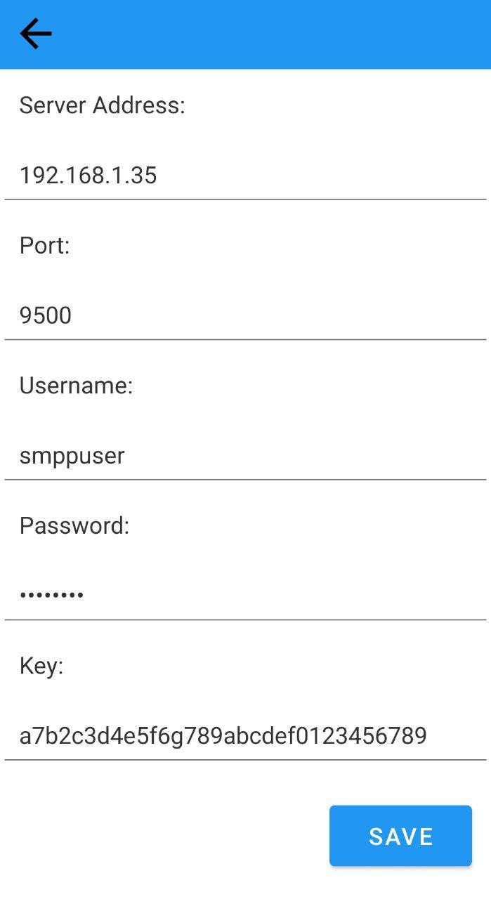

# Usage
ابتدا برنامه ozeki را connect کنید و اطلاعات را وارد تنظیمات اپ کنید. می‌توانید برای قسمت کلید از یک کلید رندوم انتخاب کنید ( البته باید برای سرور هم تغییر بدید) یا از کلید `a7b2c3d4e5f6g789abcdef0123456789` استفاده کنید.

[لینک دانلود Ozeki_Smpp_Sms_Gateway_Lite](https://github.com/samanmohammadraouf/AndroidSecureMessageProtocol/releases/download/v1/Ozeki_Smpp_Sms_Gateway_Lite.apk)

[لینک دانلود SmppClient](https://github.com/samanmohammadraouf/AndroidSecureMessageProtocol/releases/download/v1/SmppClient.apk)

# ScreenShots

|  |  |
| :--: | :--: |


|  |  |
| :--: | :--: |




# SMPP Gateway Connection 

توییتر کلاودهاپر (Twitter Cloudhopper) یک مجموعه کتابخانه‌ها برای کار با SMPP (Short Message Peer to Peer)، GSM، رمزگذاری و سایر امور مرتبط است.

این مجموعه کتابخانه‌ها در مخازن زیر قرار دارند:

https://github.com/twitter/cloudhopper-smpp

https://github.com/twitter/cloudhopper-commons-util

https://github.com/twitter/cloudhopper-commons-charset

https://github.com/twitter/cloudhopper-commons-gsm

این کتابخانه‌ها در مخزن اصلی Maven موجود هستند.

البته ما برای این پروژه فقط از cloudhopper-smpp استفاده کردیم.

```
import com.cloudhopper.smpp
```

# [Smpp](/app/src/main/java/com/example/testsmpp/Smpp.kt)

## Send SMS

ابتدا یک کلاینت ساده SMPP ایجاد مي‌کنیم تا بتواند با یک سرور SMPP كانكشن برقرار كند و با استفاده از بسته SUBMIT_SM یک پیام تکی ارسال کند.
با استفاده از متد   bind(SmppSessionConfiguration sessionConfiguration) پارامتر های session را منتقل می‌کنیم که شامل موارد زیر است:   
1) host
2) port 
3) system id
4) password

متد bind ممکن است به exception برخورد کند ( برای مثال ممکن است نتواند با host کانکشن برقرار کند) برای جلوگیری از کرش کردن برنامه باید با کمک try catch این اکسپشن هارو در صورت وقوع هندل کرد.
در صورت موفقیت‌آمیز بودن تلاش bind، کلاینت SMPP یک ابجکت session را برمی‌گرداند که در آن می‌توان PDU هارا را ارسال کرد.
بعد از ایجاد نشست، می‌توانید شروع به ارسال پیام کنید. برای ایجاد یک شیء پیام، ما متد createSubmitSm را پیاده‌سازی خواهیم کرد که SubmitSm را با توجه به پارامترهای منتقل شده جمع‌آوری خواهد کرد.

برای اینکه کانکشن از نوع ارسال برقرار شود باید type کانفیگ از نوع TRANSCEIVER باشد.

```
    val client = DefaultSmppClient()
    val session = client.bind(getSessionConfig(SmppBindType.TRANSCEIVER))

```
برای اینکه هردفعه کاربر مجبور به وارد کردن مشخصات کانفیگ نباشد ما در برنامه یک activity برای تنظیمات قرار دادیم که اطلاعات را در SharedPreferences ذخیره می‌کند.

متد زیر یک sessionConfig به عنوان خروجی برمیگرداند.

```
    private fun getSessionConfig(type: SmppBindType): SmppSessionConfiguration? {
        val sessionConfig = SmppSessionConfiguration()
        sessionConfig.type = type

        val sharedPref = context.getSharedPreferences("gateway_config", Context.MODE_PRIVATE)

        sessionConfig.host = sharedPref.getString("host", "")
        sessionConfig.port = sharedPref.getInt("port", 0)
        sessionConfig.systemId = sharedPref.getString("username", "")
        sessionConfig.password = sharedPref.getString("password", "")

        return sessionConfig
    }
```
پیام در ابتدا با استفاده از تابع encryptText که در ادامه توضیح خواهیم داد رمزنگاری می‌کنیم سپس یک ابجکت SubmitSm می‌سازیم و با استفاده از متد session.submit ابجکت را ارسال می‌کنیم.

```
    val key = sharedPref.getString("key", "")
    val enText = SecurityUtil.encryptText(text, key.toString())

    val sm = createSubmitSm("9891211", "98$number", "$$$enText$$", "UCS-2")
    session.submit(sm, TimeUnit.SECONDS.toMillis(60))
```

برای ساخت ابجکت از متد زیر استفاده می‌کنیم:
```
    @Throws(SmppInvalidArgumentException::class)
    fun createSubmitSm(src: String?, dst: String?, text: String?, charset: String?): SubmitSm? {
        val sm = SubmitSm()

        // For alpha numeric will use
        // TON=5
        // NPI=0
        sm.sourceAddress = Address(5.toByte(), 0.toByte(), src)

        // For national numbers will use
        // TON=1
        // NPI=1
        sm.destAddress = Address(1.toByte(), 1.toByte(), dst)

        // Set datacoding to UCS-2
        sm.dataCoding = 8.toByte()

        // Encode text
        sm.shortMessage = CharsetUtil.encode(text, charset)
        return sm
    }
```

 پس از ارسال پیام ، باید session , client را ببندیم.
```
        session.close()
        session.destroy()

```

## Receive SMS

برای ایجاد کانکشن مانند حالت قبلی هست فقط با این تفاوت که type کانفیگ باید از نوع SmppBindType.RECEIVER باشد.

```
    fun bindToSMSC() {
        try {
            val client = DefaultSmppClient()
            rSession = client.bind(getSessionConfig(SmppBindType.RECEIVER))
            println("Connected to SMSC...")
            println("Ready to receive PDU...")
        } catch (e: java.lang.Exception) {
            e.printStackTrace()
        }
    }

```
برای اینکه بتوانیم پیام های دریافتی رو ببینیم. تابع firePduRequestReceived را override می‌کنیم.

```
    override fun firePduRequestReceived(pduRequest: PduRequest<*>): PduResponse? {
        val response = pduRequest.createResponse()
        val sms = pduRequest as DeliverSm
        if (sms.dataCoding.toInt() == 0) {
            println("From: " + sms.sourceAddress.address)
            println("To: " + sms.destAddress.address)
            println("Content: " + String(sms.shortMessage))
        }
        return response
    }

```
اگر اپ ozeki در background ران می‌شد اتصال قطع و وصل میشد درنتیجه sms به درستی دریافت نمیشد.
درنتیجه جایگزین آن ، از BroadcastReceiver استفاده کردیم.


# [SMSReceiver](/app/src/main/java/com/example/testsmpp/SMSReceiver.kt)

یک کلاس SMSReceiver میسازیم که از کلاس BroadcastReceiver ارث بری می‌کند سپس تابع onReceive را override می‌کنیم و اگر نوع اکشن intent برای دریافت sms بود. هر پیامی که گرفتیم را در ابتدا رمزگشایی میکنیم . توافق کردیم که اگر در اخر پیام | AFTSTC بود یعنی پیام از نوع ack هست درنتیجه چک میکنیم اگر نوع ack بود به MainAcivity پیام های مربوط به ACK ارسال میکنیم در غیر اینصورت پیام های مربوط به sms عادی را ارسال می‌کنیم.
هرگاه کاربر برنامه را باز کرد پیام های مربوطه دریافت خواهد کرد.

```
class SMSReceiver : BroadcastReceiver() {
    override fun onReceive(context: Context, intent: Intent) {
        if (Telephony.Sms.Intents.SMS_RECEIVED_ACTION == intent.action) {
            val smsMessages = Telephony.Sms.Intents.getMessagesFromIntent(intent)
            for (message in smsMessages) {
                val body = message.messageBody
                val phoneNumber =  message.displayOriginatingAddress
                Log.v("SMSReceiver",body)
                Log.v("SMSReceiver",phoneNumber.removePrefix("+98"))

                val sharedPref = context.getSharedPreferences("gateway_config",
                    AppCompatActivity.MODE_PRIVATE
                )
                val key = sharedPref.getString("key", "")

                try {
                    val deText = SecurityUtil.decryptText(body, key.toString())
                    val mainActivityIntent = Intent(context, MainActivity::class.java)
                    if(!deText.contains("| AFTSTC")) {
                         //Create a new intent to send the data to MainActivity
                        mainActivityIntent.putExtra("isReceive", true)
                        mainActivityIntent.putExtra("phoneNumber", phoneNumber.removePrefix("+98"))
                        mainActivityIntent.putExtra("text", deText)


                    }
                    else
                    {
                        mainActivityIntent.putExtra("ackReceive", true)
                        mainActivityIntent.putExtra("ackPhoneNumber", phoneNumber.removePrefix("+98"))
                        mainActivityIntent.putExtra("ackText", deText.removeSuffix(" | AFTSTC"))
                    }

                    // Start the MainActivity with the new intent
                    mainActivityIntent.addFlags(Intent.FLAG_ACTIVITY_REORDER_TO_FRONT)
                    context.startActivity(mainActivityIntent)


                } catch (e: Exception) {
                    Log.v("decrypt","Error occurred during decryption: ${e.message}")
                }


            }
        }
    }
}
```

# [MainActivity](/app/src/main/java/com/example/testsmpp/MainActivity.kt)

در اندروید برای ایجاد کانکشن با host نمیتوانیم در thread اصلی اینکار را انجام دهیم درنتیجه یک thread میسازیم و در تابع ارسال SMS را صدا میزنیم. ( اگر کاربر دکمه های arrive یا exit را کلیک کند مقدار sendVal برابر true می‌شود.
)
```
       val sendSMSThread = Thread {
            try {
                while (true) {
                    if (sendVal) {
                        sendStatus = smppClient.sendSMS(number, text)
                        sendVal = false

                        runOnUiThread {
                            if (sendStatus)
                                showSendStatus(true,false)
                            else
                                showSendStatus(false,true)

                        }
                    }
                }
            } catch (e: Exception) {
                e.printStackTrace()
            }
        }

         sendSMSThread.start()
```

در این قسمت چون گوشی حکم client داره پس با sms عادی کاری انجام نمیدیم. 
ولی اگر sms از نوع ack باشد پیامی که ارسال کرده بودیم در ابتدا hash میکنیم و آن را با hash که از ack دریافت کردیم مقایسه می‌کنیم 
اگر hash ها برابر بودند و شماره ارسالی پیام با شماره دریافتی ack یکسان بود به کاربر اطلاع می‌دهیم که ack دریافت شده است ، اگر این مقادیر برابر نبودند به کاربر اطلاع می‌دهیم تا پیام را برای بار دیگر ارسال کند و اگر مشکل ادامه داشت به پشتیبانی اطلاع بدهد. ( چون ممکن است سرور مورد حمله قرار گرفته باشد. ) 

```
    override fun onNewIntent(intent: Intent) {
        super.onNewIntent(intent)

        receiveVal = intent.getBooleanExtra("isReceive", false) // Default value is 0 if not found
        rNumber = intent.getStringExtra("phoneNumber").toString()
        rText = intent.getStringExtra("text").toString()

        val aReceiveVal = intent.getBooleanExtra("ackReceive", false) // Default value is 0 if not found
        val aNumber = intent.getStringExtra("ackPhoneNumber").toString()
        val aText = intent.getStringExtra("ackText").toString()
        if (aReceiveVal) {
            val hashTmp = hashText(text)
            showSendStatus(true,false)

            if(hashTmp==aText && aNumber == number)
                showAckStatus(true, false)
            else
                showAckStatus(false,true)
        }

    }

```

# [SecurityUtil](/app/src/main/java/com/example/testsmpp/SecurityUtil.kt)

در این بخش ما توابع رمزنگاری و رمزگشایی و hash را پیاده سازی  کردیم.
 برای رمزنگاری از AES استفاده کردیم و برای hash از SHA 256.


```
    fun encryptText(text: String, key: String): String {
            val cipher = Cipher.getInstance("AES/CBC/PKCS7Padding")

            // Generate a random initialization vector (IV)
            val iv = ByteArray(cipher.blockSize)
            val ivSpec = IvParameterSpec(iv)

            // Create the secret key from the provided key
            val secretKeySpec = SecretKeySpec(key.toByteArray(Charsets.UTF_8), "AES")

            cipher.init(Cipher.ENCRYPT_MODE, secretKeySpec, ivSpec)

            val encryptedBytes = cipher.doFinal(text.toByteArray(Charsets.UTF_8))

            // Encode the encrypted bytes using Base64

            return Base64.encodeToString(encryptedBytes, Base64.DEFAULT)
        }

        fun decryptText(encryptedText: String, key: String): String {

            val cipher = Cipher.getInstance("AES/CBC/PKCS7Padding")

            // Generate a random initialization vector (IV)
            val iv = ByteArray(cipher.blockSize)
            val ivSpec = IvParameterSpec(iv)

            // Create the secret key from the provided key
            val secretKeySpec = SecretKeySpec(key.toByteArray(Charsets.UTF_8), "AES")

            cipher.init(Cipher.DECRYPT_MODE, secretKeySpec, ivSpec)

            val encryptedBytes = Base64.decode(extractText(encryptedText), Base64.DEFAULT)
            val decryptedBytes = cipher.doFinal(encryptedBytes)

            return String(decryptedBytes, Charsets.UTF_8)
        }


        private fun extractText(input: String): String? {
            val startSymbol = "$$"
            val endSymbol = "$$"

            val startIndex = input.indexOf(startSymbol)
            val endIndex = input.lastIndexOf(endSymbol)

            if (startIndex != -1 && endIndex != -1 && startIndex < endIndex) {
                return input.substring(startIndex + startSymbol.length, endIndex)
            }
            return null
        }


        fun hashText(text: String): String {
            val md = MessageDigest.getInstance("SHA-256")
            val digest = md.digest(text.toByteArray())

            val result = StringBuilder()
            for (byte in digest) {
                result.append(String.format("%02x", byte))
            }

            return result.toString()
        }

```

# [SecurityUtil](/app/src/main/java/com/example/testsmpp/SecurityUtil.kt)

برای اینکه پیام های ارسالی و دریافتی را به کاربر نشان بدهیم از کتابخانه Telephony استفاده کردیم و پیام هایی که مربوط به client و server بود را جدا کردیم و رمزگشایی کردیم و  یک لیستی ازشون درست کردیم و با استفاده از Adapter آنها را به کاربر نشان دادیم

```
 private fun readSms(): List<ChatAdapter.ChatItem> {

        val sharedPref = this.getSharedPreferences("gateway_config", MODE_PRIVATE)
        val key = sharedPref.getString("key", "")

        val numberCol = Telephony.TextBasedSmsColumns.ADDRESS
        val textCol = Telephony.TextBasedSmsColumns.BODY
        val typeCol = Telephony.TextBasedSmsColumns.TYPE // 1 - Inbox, 2 - Sent

        val projection = arrayOf(numberCol, textCol, typeCol)

        val cursor = contentResolver.query(
            Telephony.Sms.CONTENT_URI,
            projection, null, null, null
        )

        val numberColIdx = cursor!!.getColumnIndex(numberCol)
        val textColIdx = cursor.getColumnIndex(textCol)
        val typeColIdx = cursor.getColumnIndex(typeCol)

        val chatItems = mutableListOf<ChatAdapter.ChatItem>()

        while (cursor.moveToNext()) {
            val number = cursor.getString(numberColIdx)
            var text = cursor.getString(textColIdx)
            val type = cursor.getString(typeColIdx)

            if (text.contains("SMPP")) {
                text = text.replace(
                    "\n sent by Ozeki SMPP SMS Gateway for Android - www.ozekisms.com",
                    ""
                )
                text = text.replace(
                    "sent by Ozeki SMPP SMS Gateway for Android - www.ozekisms.com",
                    ""
                )
                Log.d("MY_APP", "$number $text $type")
                try {
                    val deText = decryptText(cursor.getString(textColIdx), key.toString())
                    if(type=="2")
                        chatItems.add(ChatAdapter.ChatItem(number, deText))
                } catch (e: Exception) {
                    chatItems.add(ChatAdapter.ChatItem(number, text))
                    Log.v("decrypt","Error occurred during decryption: ${e.message}")
                }

            }
        }

        cursor.close()

        return chatItems

    }
```


